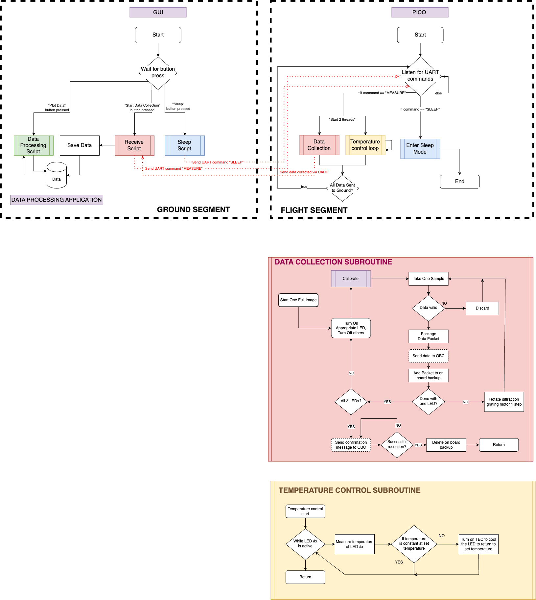

# Water Detection Payload 
The software for controlling the infrared spectrometer constructed as a Capstone Software Project by team members: 
Declan McCoy, Vlad Artyshchuk, Laurence Lamarche-Cliche, Matthew Walsh, Nick Ficele
Under the supervision of Prof. Winnie Ye, Carleton University and Guillaume Lavigne, CSA. 

## Current State of the Software 

The following represent the current state of the software, including the ground and the flight components: 




# Instructions for Using the Produced Design

## Software Setup
First, ensure that all the files for the microcontroller are saved on it. The microcontroller currently mounted on the instrument contains all the latest files, but should something happen and the microcontroller needs to be replaced, the files can be found in the [current pico files](https://github.com/LaurenceLamarche/WaterDetectionPayload/tree/main/current%20pico%20files) directory.

Then, download and open all the [GUI directory](https://github.com/LaurenceLamarche/WaterDetectionPayload/tree/main/GUI/GUI) files in a project from an application that can run Java code. I recommend using IntelliJ Ultimate or Visual Studio Code. Ensure that the `GUI.java` file is placed inside the `src` directory and that the `scripts` directory is placed at the same level as the `src` directory.

## Interfacing the Software and Hardware
First, connect a UART to USB converter to the right pins on the microcontroller as shown in the image below. Note that the first two pins must be used for UART, but the ground pins can be connected to any ground pin on the Pico. The important note here is that the UART pins must be connected to their opposites: the RX pin of the converter must be connected to the TX pin from the Pico, and vice versa.


*Connecting the UART to USB converter to connect a computer to the instrument*

Once connected, the device will show a green light, indicating that it is ready to transmit. Then, you'll have to find its location on your computer by locating the correct port. On a MAC, this is done by opening the terminal and typing: 
```
ls /dev/tty.*
```
and looking for something that looks like 
```
'/dev/tty.usbserial-A900LFQY'
```
To find the correct serial port number on Windows, open the Device Manager and click Ports (COM & LPT). Then, look for a USB Serial Port (COM#) that is unfamiliar.

Having found that number, replace it in line 180 of the `receive_script.py` script and in line 18 of the `start_script.py` files, both located in the [scripts directory](https://github.com/LaurenceLamarche/WaterDetectionPayload/tree/main/GUI/GUI/scripts) of the GUI.

## Powering the Instrument
Powering our instrument requires two power supplies: one that is 5V and one that is 9V. The 9V power supply is only required to power the motor that can mechanically sweep the diffraction gratings. If you wish to test the operation of the instrument without powering the motor, you do not have to plug it in. The code will run regardless, as error handling is implemented to account for a malfunction in the motor. However, the same is not true for the LEDs, as the 5V power supply that powers them also powers the microcontroller. A 5V power supply must be connected so that the main control software works.

## Using the Graphical User Interface to Control the Instrument
To run the code, start and control the instrument, there are a few steps that need to happen in the right order. First, the `GUI.java` file must run on the computer that is connected to the UART to USB converter, and the `main.py` file must run on the microcontroller (this will happen by default if there is power to the Pico OR with the board set in debug mode (as it currently is), with a USB cable connected to it and by running the `main.py` file manually).

Once these steps are completed, the instrument is ready to receive and parse one of the following commands:

- Pressing the **Start Data Collection** button starts the data collection process (collect data, move the motor, and regulate the temperature), and the data will be sent to the `scripts/data` directory, with a timestamp determining the file name. Pressing the start button enables the possibility to press the **Stop** button, which stops the current process and displays the number of steps performed when data collection was stopped.
- Pressing the **Plot Data** button will display the latest data that was saved to the data directory.
- Pressing the **Sleep Mode** button does nothing currently, as the logic is not yet implemented.

---
